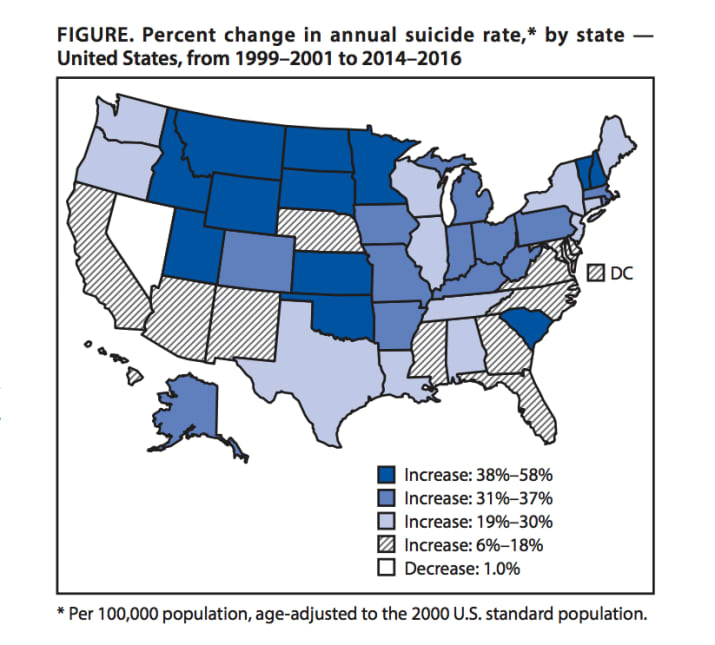
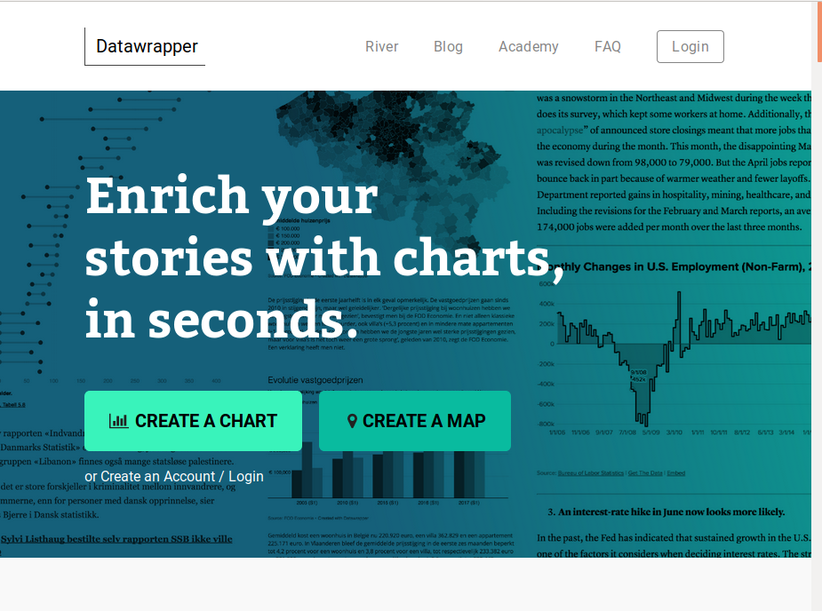
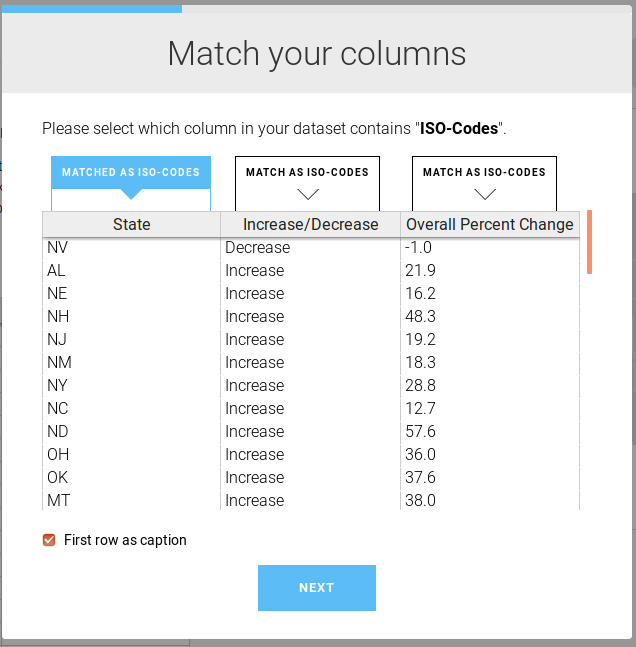

# Homework Review

# Why maps?

We use maps to understand the data, to find a story, to tell a story. Some of my favorite examples:

* [The Expanding News Desert](http://www.usnewsdeserts.com/), UNC (2018)
* [How we mapped Homan Square](https://source.opennews.org/articles/how-we-made-homan-square-portrait/), Source + The Guardian  (2018)
* [Something in the water](https://signalhfx.ca/deadly-water/), King’s College School of Journalism (2017)
* [Visualize Transit-Rich Housing](https://transitrichhousing.org/), Sasha Aickin's personal project (Spring 2018)
* [Murder with Impunity](https://www.washingtonpost.com/graphics/2018/investigations/unsolved-homicide-database/?utm_term=.e4a4e1dd6d60), Washington Post (2018)
* [Fatal Force](https://www.washingtonpost.com/graphics/national/police-shootings-2016), Washingon Post (2016)
* [How fast is LAFD where you live?](http://graphics.latimes.com/how-fast-is-lafd/#10/33.9661/-118.6201), LA Times (2012)
* [Poisoned Place](https://www.npr.org/series/142000896/poisoned-places-toxic-air-neglected-communities), NPR (2011) / [map](https://www.npr.org/news/graphics/2011/10/toxic-air/#4.00/39.00/-84.00) / [about the data](https://www.npr.org/2011/11/07/142024951/poisoned-places-about-the-data) /
* [At Risk in a Big Quake: 39 of San Francisco’s Top High Rises](https://www.nytimes.com/2018/06/14/us/california-earthquakes-high-rises.html), New York Times (2018)
* San Francisco Public Press layered the map of un-retrofitted soft story buildings over the liquefaction map provided by the USGS to create a [very rough list of unsafe buildings](https://sfpublicpress.org/softstorylist) in San Francisco.
*  [Mapping the Shoreline Building Boom as Seas Rise](https://sfpublicpress.org/news/searise/2017-04/mapping-the-shoreline-building-boom-as-seas-rise), San Francisco Public Press (2017)
* [ProPublica &amp; The Lens: Losing Ground](http://projects.propublica.org/louisiana/), ProPublica (2017)
* [Borderlands](http://apps.npr.org/borderland/#_/about), NPR (2014)
* CALmatters mapped [all the housing initiatives on the June 2018 ballot](https://calmatters.org/articles/map-how-we-voted-on-housing-issues-up-and-down-the-state/)¸CALmatters (2018)
* [A quick caveat about normalization.](https://xkcd.com/1138/)

### North Bay Fires (2017)
* [KQED Property and Structures Damage](http://ww2.kqed.org/news/2017/10/19/map-cal-fire-maps-homes-damaged-or-destroyed-in-north-bay-fires/) was the most visited during the fires.
* [KQED](https://ww2.kqed.org/science/2017/10/31/map-see-if-you-live-in-a-high-risk-fire-zone-and-what-that-means/) looks at fire hazard zones, which are public record. Most of the devastating 2017 Napa and Sonomoa fires were in "moderate" fire hazard zones.


## Projections, Shapes, Points, and Lines

[](https://xkcd.com/977/)

### Mapping Points
"Geocoding" refers to the process of identifying an individual latitude/longitude pair for an address or other location description. To actually plot a location on a map, you need the location's latitude and longitude. `219 West 40th Street` means nothing without coordinates.

Geocoding is often challenging because there aren't great free resources for doing batch jobs or processing many addresses at once. The [Geocoding Tip Sheet](https://github.com/amandabee/cunyjdata/wiki/Tip-Sheet:-Geocoding) is a round up of good options, but often public data sources already include coordinates.

### Mapping Lines
We use lines pretty rarely in intro maps, but a line is  a series of two or more points connected together.

### Mapping Polygons
Zipcodes, council districts, police precincts -- these are all polygons. Most of your maps will be in polygons. These polygons are defined in (usually) one of two specialized file formats -- a "Shapefile" or a "KML" file. The syntax of the file types varies, but they contain basically the same information -- the polygon called "Bronx CB 04" is defined by this series of lat/lon pairs.

Usually your data won't include a shapefile. If you have high school graduation rates by school district, and you want to map those, you need to find a shapefile that describes the outline of each school district, and then you need to combine that shapefile with your data, by identifying a column that the two tables have in common.

The [Shapefiles Tip Sheet](https://github.com/amandabee/cunyjdata/wiki/Where-to-Find-Shapefiles) has some excellent resources for finding shapefiles.

# Making a map in Datawrapper


Caroline Kee covered a pretty straightforward, if disturbing, CDC report on [rising suicide rates nationwide](https://www.buzzfeed.com/carolinekee/suicide-rates-increase-us-2016-all-states). The map she included came directly from the CDC. It isn't a terrible map, but there are a few ways it could be much better. Can you tell at a glance **which states stand out** as having the most severe increase?

Take a look at the legend. The sizes on those buckets are wild. The darkest has a 20 percentage pt spread, and the next has just a six percentage pt spread. These are quantiles: the CDC designed the buckets so that each would have 12 states in it. And then they chipped off Nevada which is the only state that saw a decrease.




Luckily, BuzzFeed News actually links to the original report -- the raw data is available in the CDC's [original report](https://www.cdc.gov/vitalsigns/suicide/infographic.html#graphic1) which appeared in the [Morbidity and Mortality Weekly Report](https://www.cdc.gov/mmwr/index.html). To avoid hiccups in the copy and paste process, I went ahead and pulled the numbers for you. Question: is this data organized into points, lines or shapes?

<https://app.workbenchdata.com/workflows/5852>

Workbench is still a work in progress but one thing it does well is show the transformations I applied to the original data.

**Step 0:** Download the csv from Workbench.

**Step 1:** Log into Datawrapper and choose "Create a map". We want a choropleth.



**Step 2:** (Datawrapper thinks of this as Step 1), search for "USA States" under "What type of map do you want to create?".

Fun question that came up Week 1, that I couldn't answer off the top of my head: *Why is the electoral college hex map different from the population map?* It turns out there are a few reasons. First, as I noted, the census updates population estimates more often than the electoral college is redesigned. Second, the actual electors aren't based entirely on population. Each state gets one Elector for each senator (2) and one for each congress person (varies, maps are redrawn every 10 years). DC always gets 3 Electors (or, no more than the least populous state).

The Washington Post did some deeper reporting asking why North Dakota stands out so much.  [It's worth reading if you're interested in that question.](https://www.washingtonpost.com/news/to-your-health/wp/2018/06/07/u-s-suicide-rates-rise-sharply-across-the-country-new-report-shows/)

**Step 3:** Import your dataset. But get in the habit of reading pop up windows. Do we have ISO-Codes or Names here?

Once you've uploaded your data, read through the next screen, too.



As you step through these dialog windows, they should make sense!

You've already got a much cleaner map. But we're going to hit `Proceed` and make it better.

**Step 4:** Customize your gradient and your tooltips. The average nationwide was a 25.4% increase. You could reasonably center your buckets there. Or you can keep the default gradient. And make some tooltips.

```
\{\{ Increase_Decrease }} of {{ Overall_Percent_Change }}%
```

**Step 5:** Add your title and description. Never skip the metadata.

**Title:** What is the takeaway here? In the story, they captioned this "Suicide rates increased in almost all states between 1999 and 2016 — some by more than 30%.", but the chart uses "Figure. Percent change in annual suicide rate,* by state-- United States , from 1999/2001 to 2014/2016"

**Caption:** Tell your readers more about what we're looking at. "A recent CDC report found that there is just one state in the union -- Nevada -- where suicides did  not rise between 1999 and 2016."

**Step 6:** Embed it!

Fun Question that came up Week 3 -- *If these rates are both based on the 2000 population, how much does this map just reflect population growth?* One answer, from the Census, is that between 2000 and 2010 [Nevada was the US state with the the highest growth](https://www.census.gov/newsroom/blogs/random-samplings/2011/03/population-distribution-and-change-2000-to-2010.html).


# Making a Map in Fusion Tables

The Washington Post collected data on more than 52,000 criminal homicides over the past decade in 50 of the largest American cities. I filtered out two local cities so we could take a closer look.
[Homicides in Oakland](https://app.workbenchdata.com/workflows/5840) \ [Homicides in San Francisco](https://app.workbenchdata.com/workflows/5853/). We could map these in Datawrapper but we're going to get frustrated with their built in maps.

Question: Is this data points, lines, or shapes?


1. Find the URL for the cleaned and filtered CSV in Workbench. Copy that.

1. Create a new spreadsheet. Populate it with the `=IMPORTDATA()` function. What does the help menu say about how to use `=IMPORTDATA()`?

2. Format the `reported_date` column so it reads as dates.

3. Create a new column and calculate the number of days the case has been open with  `=DAYS(TODAY(),D2)` -- stop and read what `=DAYS()` and `=TODAY()` do. What do they do?

4. 🤔 What is wrong with this picture? (Hint: it's in the `disposition` column.) Not all of these homicides are "unsolved". Keep this in mind as we keep working.

4. Create a new Fusion Table. Go to Google Drive and select *New > More > Google Fusion Tables* (you might have to connect Fusion Tables as an app).

5. Which column contains our location? We actually need a "two column location" which could be more intuitive than it is.

7. This data actually contains all homicides, open and closed. So let's play with a few ways to handle that.  
  * Filter out the solved homicides.
  * [Style the map by disposition](https://support.google.com/fusiontables/answer/2476954?hl=en&ref_topic=2575652) -- a process that should be easier than Google makes it.

9. Last step, *Tools > Publish*

Note: [New Media Report](https://newmedia.report/tutorials/google-maps/) includes a nice Google Map tutorial if you want to keep playing with Google Maps.

## Mapbox

Another excellent option if you're willing to learn (or cut and paste) some javascript is Mapbox Studio. Their order of operations is kind of nuanced and not obvious or intuitive if you're not familiar with some core principles of publishing maps on the internet. Their [sample workflow](https://www.mapbox.com/studio-manual/overview/#sample-workflow) is a good starting point, but it won't be 100% clear until you've spent some time working with their tools.

[Styles](https://www.mapbox.com/studio-manual/reference/styles/) are the visual rules that control how your map is drawn on the page. [Tilesets](https://www.mapbox.com/studio-manual/reference/tilesets/) are mapbox's primary data format. A tileset is a collection of images broken into a uniform grid of tiles, ready to load at various zoom levels. (If you've ever zoomed too fast on a Google Map you've seen tiles in action.) [Datasets](https://www.mapbox.com/studio-manual/reference/datasets/) are the editable feature collections that tilesets are built from. A dataset is your collection of lines, points, or shapes, with descriptive data attached.

0. Download the unsolved homicides CSV that you're interested in. Make sure you know where your computer stored it.
1. Make an account.
2. Head into [Mapbox Studio](https://www.mapbox.com/studio/) once you're logged in.
3. On the "Datasets" tab, click on "New dataset" -- upload your csv.

You can very quickly start looking at the data on a map. We can also go back to the Studio menu and start to work on making styles. Mapbox likes to start in Paris. If you aren't making a map of Paris search for a different city so you can center your map there.

Add a layer. Even though you already uploaded it, you want to select "upload" and then look for Create From Dataset.

We'll play with this together until we have points on a map. And you can embed that map and make it zoomable. To add any interactivity, however, you have to start with some of their javascript tutorials.


# Homework
Pick one of the data sets you identified and map it!

# Resources

* We use **QGIS** and **PostGIS** in the data investigations class because it is much more powerful analytical tool. The learning curve is a bit steep, however, and QGIS doesn't produce  interactive maps. QGIS will generate SVG files that you can style in Illustrator or any other vector graphics editor for publication.
* **R** is powerful statistical software and not easy to learn. These [Dutch election maps](https://multimedia.tijd.be/2018/verkiezingen2018/) were made in ggplot2 (an R package) -- working from [a comprehensive tutorial tutorial](https://timogrossenbacher.ch/2016/12/beautiful-thematic-maps-with-ggplot2-only/#more-intuitive-legend). Like QGIS, R will generate SVG files that you can style in Adobe Illustrator or any other vector graphics editor.
* You can make maps in **D3**, but not without getting code on your hands. [Mike Bostock has a solid tutorial](https://medium.com/@mbostock/command-line-cartography-part-1-897aa8f8ca2c)
* For years, I taught students how to use **[Carto](https://carto.com/)** because it is easy to master and flexible. Unfortunately, they no longer offer a free tier to anyone but students, which means that if you're just publishing your first one or two maps, you have to commit to a paid account. They don't even publish the pricing for those accounts anymore. Sad trombone.
* **Tableau** generates good maps. Peter Aldhous has a nice [Tableau walkthrough](http://paldhous.github.io/ucb/2016/intro-data/week4.html) from 2016. Unfortunately, I've never met a graphics editor who didn't have some kind of tableau horror story.
* **[Mapbox](https://www.mapbox.com/)** is powerful if you're game to learn some javascript (or just to cut and paste). Lo Benichou has written some fantastic [Mapbox tutorials](https://www.mapbox.com/help/tutorials/). And if you don't want or need interactivity, Mapbox Studio will let you design gorgeous map tiles, no javascript needed.

## Other good tutorial options
* [Dan Nguyen has a nice roundup](http://www.padjo.org/tutorials/#mapping) of his tutorials.
