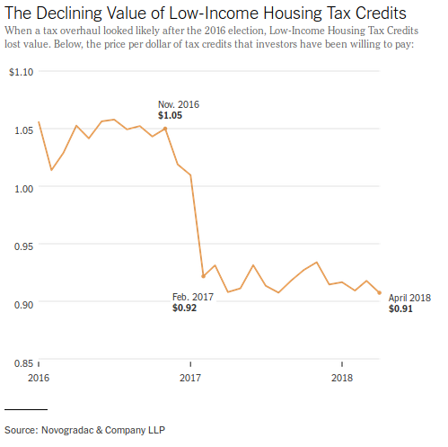
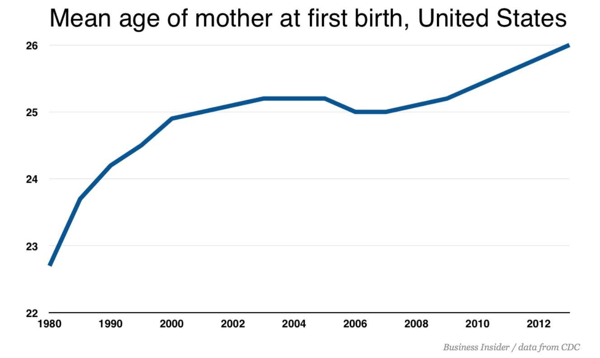
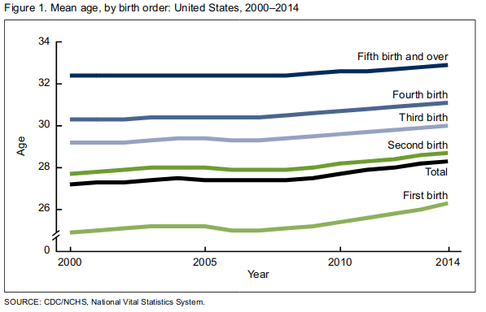
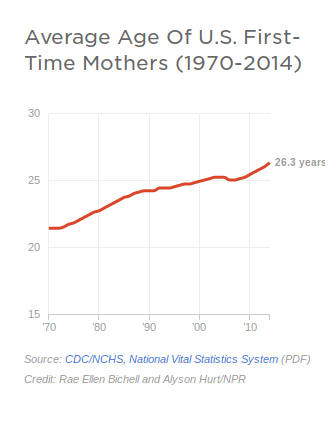
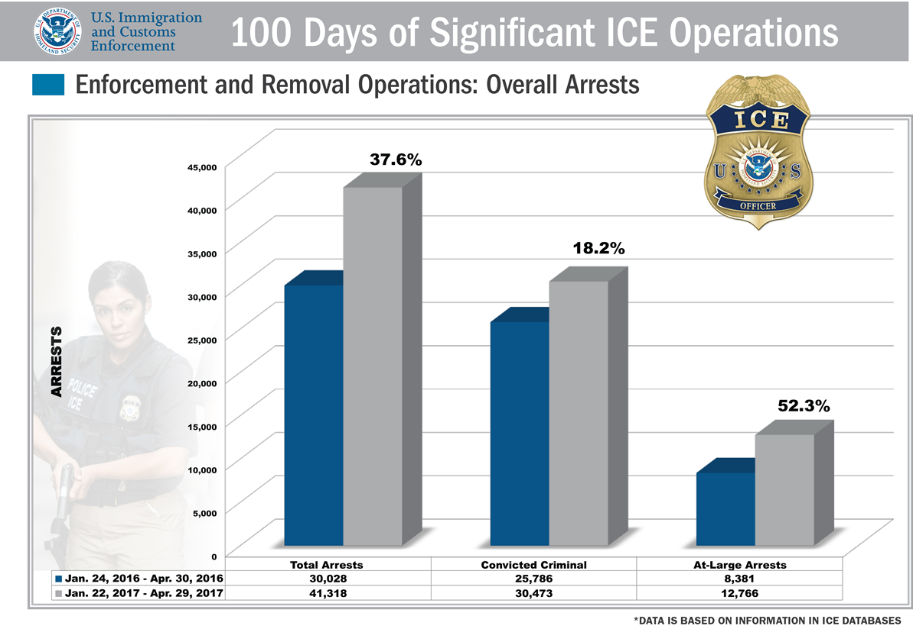
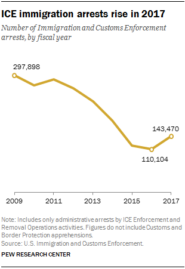
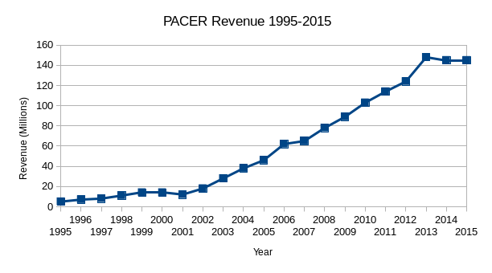

If you haven't already created accounts on both [Workbench](https://app.workbenchdata.com/account/signup/) and [Datawrapper](https://app.datawrapper.de/signin) please go ahead and do that.

# Finding and Cleaning Data

Good starting points for finding data:
+ [Tips on Searching for Data](https://github.com/amandabee/workshops/wiki/Where-to-Find-Data:-Search-Tips)
+ [Where to Find Data](https://github.com/amandabee/workshops/wiki/Where-to-Find-Data)

[Peter Aldhous](https://www.peteraldhous.com/) has some fantastic tips for getting creative in his [lesson plan](http://paldhous.github.io/ucb/2016/dataviz/week5.html) from his Data Visualization course.

[Mago Torres](https://www.magotorres.net/) has a few great stories about the benefit of a little creativity if you're working on an international story. If the US won't give you details of a meeting between US and Mexican officials, don't assume you can't get what you need from the Mexican government.

## It's People!


Quiz: what is the fastest way to reduce the number of murders in a single precinct?

<!-- Answer: start categorizing them as something else. -->


## Using Workbench to Clean Data

Peter Aldhous has a great walk through that will show you how to [use OpenRefine](http://paldhous.github.io/ucb/2016/dataviz/week5.html) to clean up data.

We're going to use Workbench, only because I think it does a nice job of providing an easy to read audit trail. The two tools aren't exactly interchangeable but knowing what is possible is the first step.

I replicated those data cleaning exercises so we can walk through them and explore Workbench. The first uses a CSV of data from the [U.S. Energy Information Administration](http://www.eia.gov/cfapps/ipdbproject/iedindex3.cfm?tid=5&pid=53&aid=1&cid=regions,&syid=2000&eyid=2014&unit=TBPD) on regional oil production. The numbers given are thousands of barrels per day. (Specifically, I used their data browser to get ["Total Petroleum and Other Liquids" from 2000 to 2017](https://www.eia.gov/beta/international/data/browser/#/?pa=000gfs0000000000000000000000000000vg&c=4100000002000060000000000000g000200000000000000001&ct=2&tl_id=5-A&vs=INTL.53-1-AFRC-TBPD.A&cy=2014&vo=0&v=H&end=2017))

You can see my work at: <https://app.workbenchdata.com/workflows/5908/> but don't use "duplicate" -- we're going to walk through this from scratch.

1. Start by duplicating my workflow: <https://app.workbenchdata.com/workflows/6630/>

2. Transform it into a functional spreadsheet using ...
  * "Delete Rows" to delete rows 1-3 and 5-8
  * Edit the cell that is missing a header
  * "Rows to Header" to move the header where we want them
  * Rename  the columns to drop those annoying decimals:
  `delete me, region, 2000, 2001, 2002, 2003, 2004, 2005, 2006, 2007, 2008, 2009, 2010, 2011, 2012, 2013, 2014, 2015, 2016, 2017`
  * Use the context menu on the first column, or "Select Columns" to delete it.

3. Once we've got the data cleaned up, we can actually reshape it into something we might be able to chart.
  * Select "Reshape" and then "Transpose" to transpose the data
  * Use "Rename" to label the "year" column
  * "Convert to Date and Time"
  * "Line Chart"

Secretly, Workbench's charting is a little wonky, so I'd move over to another charting tool if I wanted to see this visualized.

## More Cleaning in Workbench
[USA Spending](https://www.usaspending.gov/#/) tracks federal government spending. We can use their [Advanced Search](https://www.usaspending.gov/#/) to pull up a list of [grants to DUNS 9214214 and 124726725](https://www.usaspending.gov/#/search/fc06ccc70169c1f2695f1db9c5f9ba4b), aka Berkeley and Stanford. The data they provide is a lot cleaner than it was in 2014, but you can see an example of the kind of filtering you can do in my demo at <https://app.workbenchdata.com/workflows/5912/>

Note that this demo makes use of [regular expressions](http://velociraptor.info/talks/2014/NICAR/regex) which are awesome and also [exasperating](https://www.xkcd.com/1171/). [Rubular](http://rubular.com/) and [Regex101](https://regex101.com/) might make your regular expression journey more sane.

**Challenge:** The state of California publishes data on who gave money to support or oppose individual ballot measures. Find and tidy the Prop 10 donors.

# Making Really Good Charts
[Source](https://source.opennews.org/) publishes a lot of great "How we built it" stories that ought to inspire you. [Their Q & A with Alvin Chang](https://source.opennews.org/articles/value-human-text-analysis-q-alvin-chang/) on his quick-turnaround Vox graphic that showed unanswered questions from the Kavanaugh hearings is great.

[](https://www.darkhorseanalytics.com/portfolio/data-looks-better-naked-bar-charts)

Look at what makes NYT Charts work. I'm 100% open to design innovation but there are some pretty good established formulas that we can lean on:



[These 95 Apartments Promised Affordable Rent in San Francisco. Then 6,580 People Applied.](https://www.nytimes.com/2018/05/12/upshot/these-95-apartments-promised-affordable-rent-in-san-francisco-then-6580-people-applied.html) *New York Times*, May 12, 2018

## Don't Make Bad Charts

Are millenials really having fewer children? The answer is probably "duh, of course they are". But looking at stories about the data there are a lot of examples of y-axis shenanigans:

* This writer cribbed his charts from Business Insider, but check out the y-axis in [the chart he included](https://www.linkedin.com/pulse/why-many-millennials-wont-have-children-michael-spencer/).  Bonus: what is wrong with his x-axis?



* If you look at the same data with a wider Y-axis spread, you see something that looks a lot more like a steady trend, as in an [NPR piece](https://www.npr.org/sections/health-shots/2016/01/14/462816458/average-age-of-first-time-moms-keeps-climbing-in-the-u-s) about the same data [or the CDC report](https://www.cdc.gov/nchs/data/databriefs/db232.pdf) that precipitated the coverage.




**Discussion:** let's talk about what data would get at that question, and go look at the data. We want two things: mean age at first birth, and birth rate. And we want to know whether millenials stand out or are just being consistent with long-standing trends.

# Making A Simple Chart

Using the data at <https://app.workbenchdata.com/workflows/6631/> (which I pulled from the CDC report cited in most of the pieces above), let's make a chart in Datawrapper.

1. Find the URL to download the csv from workbench or copy the live link.
2. Make a new chart in Datawrapper. Use "Link External Dataset" to provide the URL. We could probably use workbench to serve the data but Datawrapper is a safer choice.
3. Power through step 2 ("Check and Describe") but we'll come back to it.
4. Look at the raw chart.
5. Back to Step 2 ("Check and Describe") to select individual columns that we want to hide from the visualization.
6. Refine, Annotate and Design it. We've got 3 different takes on this data to crib from. Set up a title, a description, any notes that you think are appropriate. When you're happy with your work, publish it and share the URL, with your name, at <https://etherpad.opennews.org/p/maps_and_charts>

## One More

[](https://www.ice.gov/features/100-days) **Questions:** What does this chart show? What is 38%? 52%? What do those represent?  What does the grey represent?

Pew covered the same numbers but added context and specificity to their chart (and ommitted the 3D renderings).
[](http://www.pewresearch.org/fact-tank/2018/02/08/ice-arrests-went-up-in-2017-with-biggest-increases-in-florida-northern-texas-oklahoma/)

<!--FWIW, what the ICE chart is showing that total arrests were up 37.6% in 2017. Convicted criminal arrests were up 18.2% and at-large arrests up 52.6% (their math is a little off).-->

I manually copied out the data from the ICE chart above. You can paste it straight into Datawrapper:

```
2016	2017	Percent Change
Total Arrests	30028	41318	37.6%
Convicted Criminals	25786	30473	18.2%
At-Large Arrests	8381	12786	52.6%
```

*note:* If copy and paste aren't working for some reason, you can also grab the [data in a CSV](ice_arrests.csv). Right click to grab the URL for the data, or download it and upload it to Datawrapper.

Spend some time in Datawrapper experimenting with how you want to display this data.

Here's my version of those same numbers:
<iframe id="datawrapper-chart-Ztj22" src="//datawrapper.dwcdn.net/Ztj22/1/" scrolling="no" frameborder="0" allowtransparency="true" style="width: 0; min-width: 100% !important;" height="240"></iframe><script type="text/javascript">if("undefined"==typeof window.datawrapper)window.datawrapper={};window.datawrapper["Ztj22"]={},window.datawrapper["Ztj22"].embedDeltas={"100":605,"200":360,"300":300,"400":283,"500":240,"700":223,"800":223,"900":223,"1000":223},window.datawrapper["Ztj22"].iframe=document.getElementById("datawrapper-chart-Ztj22"),window.datawrapper["Ztj22"].iframe.style.height=window.datawrapper["Ztj22"].embedDeltas[Math.min(1e3,Math.max(100*Math.floor(window.datawrapper["Ztj22"].iframe.offsetWidth/100),100))]+"px",window.addEventListener("message",function(a){if("undefined"!=typeof a.data["datawrapper-height"])for(var b in a.data["datawrapper-height"])if("Ztj22"==b)window.datawrapper["Ztj22"].iframe.style.height=a.data["datawrapper-height"][b]+"px"});</script>

## More Recent Examples

<!-- + [80,000 Americans died of the flu last winter. Get your flu shot.](https://www.vox.com/platform/amp/2018/9/27/17910318/80000-americans-died-last-year-get-your-flu-shot) *Vox*, October 19, 2018; is still on my list because I would swear it included a good chart. -->

+ [Amazon scraps secret AI recruiting tool that showed bias against women](https://www.reuters.com/article/us-amazon-com-jobs-automation-insight/amazon-scraps-secret-ai-recruiting-tool-that-showed-bias-against-women-idUSKCN1MK08G) *Reuters*, October 9, 2018 has a nice clean chart of the sort that's in our wheelhouse.

## Charts to Discuss
+ [Homelessness in the Bay Area](https://www.spur.org/publications/urbanist-article/2017-10-23/homelessness-bay-area) *Spur: The Urbanist*, October 23, 2017
+ [Californians: Here’s why your housing costs are so high](https://calmatters.org/articles/housing-costs-high-california/) *CALMatters*, August 21, 2017
+ [Why is Sacramento failing its black students?](http://www.newsreview.com/sacramento/why-is-sacramento-failing-its/content?oid=26402481) *Sacramento News and Review*, June 14, 2018

<!-- Not sure why this is here
[Biya’s private travels: The story behind the story](https://www.occrp.org/en/other-articles/7753-biya-s-private-travels-the-story-behind-the-story) *OCCRP*, March 12, 2018 -->

# Homework, Due Thursday

Read [New bill would finally tear down federal judiciary’s ridiculous paywall](https://arstechnica.com/tech-policy/2018/09/new-bill-would-finally-tear-down-federal-judiciarys-ridiculous-paywall/) *Ars Technica*, September 17, 2018

The article includes a chart that shows just how much PACER's revenue has grown in the 30 years since it was founded. It's a perfectly good chart but we can definitely apply some of the basic design guidelines we looked at in class to improve on it.

*Ars Technica* cribbed their chart from the Free Law Project, [How Much Money Does PACER Make?](https://free.law/2016/11/14/how-much-money-does-pacer-make/) *Free Law Project*, November 14, 2016 and the Free Law Project shared the source of their data. You can pull [the xls url](https://free.law/xlsx/pacer-revenue-over-time.xlsx) into Workbench or just copy and paste the data. If copy and paste is acting wonky, you can also [use this csv](pacer_revenue.csv).


Re-make or re-design the *Ars Technica* chart in Datawrapper:

```
Year	PACER Revenue (Millions)
1995	5
1996	7
1997	8
1998	11
1999	14
2000	14
2001	12
2002	18
2003	28
2004	38
2005	46
2006	62
2007	65
2008	78
2009	89
2010	103
2011	114
2012	124
2013	148
2014	145
2015	145
```

Post a link to your chart at: <https://etherpad.opennews.org/p/maps_and_charts>

For extra credit, look at the notes from the Free Law Project and see if you can find 2016 and 2017 figures. Pay attention not only to the data, but also to the framing. Give your chart a title, think about the labels you do and don't want to include.

Identify at least three data sources that you're interested in working with. One should be about places. Pull each into Workbench and make them Public. Share the URLs at:
<https://etherpad.opennews.org/p/maps_and_charts>


# Resources to Keep Learning

If you don't have a copy of Sarah Cohen's [Numbers in the Newsroom](http://store.ire.org/products/numbers-in-the-newsroom-using-math-and-statistics-in-news-second-edition) get one. Read it through. She covers a lot of vital information about working with and writing about numbers.

If you don't already feel comfortable with spreadsheets, you should work through the exercises in AMI's [Spreadsheet Basics](https://multimedia.journalism.berkeley.edu/tutorials/spreadsheet-basics/). If you don't have Safari or want additional refreshers, take a look at...
+ Peter Aldhous's [Interviewing Data](http://paldhous.github.io/ucb/2016/intro-data/week3.html) lesson plan from J200
+ [Spreadsheet Refresher](https://ucb-dataj.github.io/2018/week3.html#spreadsheets) from J298
+ [Spreadsheet Skills](http://amandabee.github.io/CUNY-data-skills/hands-on/spreadsheets.html)

If you're ready to do more with the data and charts...

+ Source publishes some fantastic [guides to wrangling data](https://source.opennews.org/guides/working-data/) and [making charts](https://source.opennews.org/guides/making-charts/), and their [Things You Made](https://source.opennews.org/articles/tags/roundup/) series is a great place to find ideas and inspiration.
+ [NICAR-L](http://www.ire.org/resource-center/listservs/subscribe-nicar-l/)
+ [NICAR and IRE conferences](http://ire.org/conferences/)
+ Stack Exchange
+ [Nathan Yau's tutorials](http://flowingdata.com/) are great.
+ Jeremy Singer Vine's [Intro to VisiData](https://jsvine.github.io/intro-to-visidata/) is a nice intro to a great tool for summary visualizations
+ [Conversations with Data](http://r.mediapusher.eu/cqnoa8v5s2cnf.html) and [Data is Plural](https://tinyletter.com/data-is-plural/archive) are great newsletters
