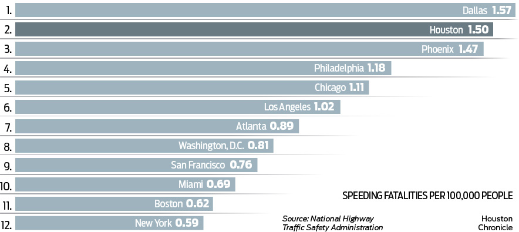

# Start here
If you haven't already created accounts on both [Workbench](https://app.workbenchdata.com/account/signup/) and [Datawrapper](https://app.datawrapper.de/signin) please go ahead and do that.

This week we're going to cover finding data, cleaning it up, and presenting it in chart form. When I come back on April 4, we'll tackle mapping.

I'm assuming everyone has worked through either Paul Grabowicz's [Spreadsheet Tutorial](https://multimedia.journalism.berkeley.edu/tutorials/spreadsheets/) or the [Berkeley AMI interactive tutorial](https://multimedia.journalism.berkeley.edu/tutorials/spreadsheet-basics) -- the latter only works on Safari, but Paul's walk-through works anywhere.

## Examples

[Meatless Burgers Stoke Sales and Questions About Nutrition](https://www.wsj.com/articles/meatless-burgers-stoke-sales-and-questions-about-nutrition-11564653600) in *Wall Street Journal* includes some nice clear charts.

*Seattle Times* reported on [double booked surgeons](https://www.seattletimes.com/seattle-news/times-watchdog/swedish-neuroscience-institute-double-booked-overlapping-surgeries/) -- the charts they included provide another view of the story and illustrate what it actually means to double book a surgeon.

The [IRE Awards](https://www.ire.org/awards/ire-awards/winners/2017-ire-award-winners) are always an opportunity to get inspired by great data projects.

Oregon Live and *The Oregonian* ran a lengthy [series on elder abuse](https://www.oregonlive.com/health/page/elder_abuse_and_neglect_in_oregon_nursing_homes.html) including some [charts that shed light](https://expo.oregonlive.com/news/erry-2018/10/07165d5cf21014/dementia-care-is-expensive-but.html) on the kinds of abuses experienced in residential facilities. They also published a complete [database of facility complaints](https://projects.oregonlive.com/long-term-care/facilities/).

*Asbury Park Press* analyzed quite a bit of data for their award winning reporting on [renter hell](https://www.app.com/story/insider/extras/2016/12/30/renter-hell-part-1-billions-squalor/96011730/). They didn't produce a lot of charts but the numbers were still key to understanding where the story was.

Data visualization doesn't have to be data driven. This chart of [QZ Brexit paths](https://qz.com/1571189/what-happens-now-that-theresa-may-lost-her-brexit-deal-vote/) helps tell a chutes-and-ladders like story.

Often charts are relatively simple. CalMatters ran a long report on [families struggling to get mental health care](https://calmatters.org/articles/californians-struggle-to-get-mental-health-care/) and included a couple of charts.

*Star Tribune* included a few charts in [their reporting on senior homes](http://www.startribune.com/senior-home-residents-are-abused-and-ignored-across-minnesota/450623913/) that just illustrate the scope of the problem.

The Intercept dug into data on [terrorism prosecutions](https://trial-and-terror.theintercept.com/) in the US. They also looked at [sexual abuse of prisoners in ICE custody](https://theintercept.com/2018/04/11/immigration-detention-sexual-abuse-ice-dhs/). Both took substantial digging.

Alvin Chang's data viz explainer on [how the rich got rich and the poor got poor](https://www.vox.com/2016/5/23/11704246/wealth-inequality-cartoon) in Vox is a great example of the ways that we can use data visualization to make sense of complex numbers. He also used [potatoes to explain how a 70% tax rate would work](https://www.vox.com/videos/2019/2/12/18220925/70-percent-top-tax-optimal-theory-ocasio-cortez) and [how tax brackets really work](https://www.vox.com/2019/1/18/18187056/tax-bracket-marginal-video).


+ [Amazon scraps secret AI recruiting tool that showed bias against women](https://www.reuters.com/article/us-amazon-com-jobs-automation-insight/amazon-scraps-secret-ai-recruiting-tool-that-showed-bias-against-women-idUSKCN1MK08G) *Reuters*, October 9, 2018 has a nice clean chart of the sort that's in our wheelhouse.
+ [Homelessness in the Bay Area](https://www.spur.org/publications/urbanist-article/2017-10-23/homelessness-bay-area) *Spur: The Urbanist*, October 23, 2017
+ [Californians: Here’s why your housing costs are so high](https://calmatters.org/articles/housing-costs-high-california/) *CALMatters*, August 21, 2017
+ [Why is Sacramento failing its black students?](http://www.newsreview.com/sacramento/why-is-sacramento-failing-its/content?oid=26402481) *Sacramento News and Review*, June 14, 2018

## Data isn't magic


What is the fastest way to reduce the number of murders in a single precinct?

Data is only as good as the people who enter it. Before you rely on data for your reporting you need to know who generated it and how the data you’re looking at got into the database.

Data is almost always entered by people. The fastest way to reduce the number of felony robberies in a single police precinct is to start [classifying incidents as misdemeanors](https://www.nytimes.com/2003/06/20/nyregion/west-side-crime-statistics-were-softened-police-say.html), and there’s good evidence that New York Police Department precincts did exactly that when the commissioner started rewarding precincts that got their serious crime rates down.  

It isn’t clear why Baltimore County Police Department has more “unfounded” rape complaints than most departments nationwide, but [BuzzFeed News found](https://www.buzzfeednews.com/article/alexcampbell/unfounded) that many of those “unfounded” complaints were never really investigated.
Sometimes there are just quirks in the way data gets recorded --  one report found that coroners don’t have solid standards about how to decide whether to record a gun death as [accident or homicide](https://www.nytimes.com/2013/09/29/us/children-and-guns-the-hidden-toll.html) and as a result, accidental homicides are split between the two categories, making it hard to track down reliable data.

Data is powerful but it is never a substitute for picking up the phone and making some calls. If you’re just starting to think about where data fits in  your reporting process, Samantha Sunne wrote an excellent introduction to the [challenges and possible pitfalls of data journalism](https://www.americanpressinstitute.org/publications/reports/strategy-studies/challenges-data-journalism/), and how you can you avoid them.  

<!-- Answer: start categorizing them as something else. -->

# Finding and cleaning data

Data is a powerful reporting tool. It lets us scrutinize public spending and policy outcomes, challenge conventional wisdom and participate more fully in public conversations. A decade of open data activism has left reporters and the general public with unprecedented access to public payrolls, traffic reports, police data and much more. All of it allows us to hold policy makers accountable and understand the world in ways we couldn’t without access to the numbers.

## Finding it

Whether you’re a seasoned data journalist or brand new to thinking about data as a source in your reporting, there are exceptional places to find data that you may never have considered. My most recent post on Source, [The Totally Incomplete Guide to Finding and Publishing Data](https://source.opennews.org/articles/totally-incomplete-guide-finding-and-publishing-da/) is an excellent resource.

Who has data now, and how can you get your hands on it?

The best way to start looking for data you need is almost always to ask yourself who could collect this data and look at where they might share it. Are there city, county, state, or national agencies that collect data? Do they publish it? If they don't publish data, what happens when you ask for it? Sometimes all you have to do is ask, sometimes you have to file a more formal freedom of information request for the data.

Are there private research organizations or non-profits that keep data on the subject you're researching?

Once you've exhausted the direct approach, or you're just interested in sparking some inspiration, there are a few more great places to look for data and ideas.Lots of newsrooms push cleaned data (and [code](https://source.opennews.org/code/)) to **github** but there's not a unified way to find it all. [Washington Post](https://github.com/washingtonpost/) has released a collection of data on school shootings, police involved shootings, and unsolved homicides, along with valuable context about how the data was collected and processed. [BuzzFeed News](https://github.com/BuzzFeedNews) maintains an [indexed overview](https://github.com/BuzzFeedNews/everything) of all the data they've published to github, as does [538](https://github.com/fivethirtyeight/data).  Here are a few more:

*   [Asbury Park Press](http://php.app.com/agent/) (Asbury Park, NJ)
*   [Arizona Central](https://www.azcentral.com/local/data/) recently launched a data hub.
*   [BuzzFeed News](https://github.com/BuzzFeedNews)
*   [Courier Journal](https://www.courier-journal.com/data/) (Louisville, KY)
*   [Houston Chronicle](https://data.world/houstonchronicle/) (Houston, TX)
*   [Naples Daily News](https://data.naplesnews.com/) (Naples, FL)
*   [New Jersey Advance](https://data.world/njdotcom) publishes their data on data.world
*   [New York Times](https://github.com/NYTimes) maintains a repository that's mostly code. They also publish some data via [The Upshot](https://github.com/TheUpshot)
*   [News Press](https://data.news-press.com/) (Cape Coral, FL)
*   [NPR Visuals](https://github.com/nprapps) publishes mostly code.
*   [ProPublica](https://www.propublica.org/datastore/) ([their GitHub repository](https://github.com/propublica) includes more data as well as a fair amount of reusable code)
*   [Quartz](https://github.com/Quartz) includes data along with a ton of helpful code in their GitHub repository.
*   [Tallahassee Democrat](https://data.tallahassee.com/) (Tallahassee, FL)
*   [Vancouver Sun](https://github.com/chadskelton/data)
*   [Washington Post](https://github.com/washingtonpost/)
*   [538](https://github.com/fivethirtyeight/data)

[Chicago Data Collaborative](https://chicagodatacollaborative.org/) includes data that newsrooms, academics and advocates have compiled to better understand criminal justice in Chicago.

[Wireservice's Lookup](https://github.com/wireservice/lookup/) repository is a collection of very useful lookup tables for BLS, IPUMS and some Fed data. (Wireservice is a collaboration between a number of US newsroom developers and data reporters.)

More tips on [searching for data](https://github.com/amandabee/workshops/wiki/Where-to-Find-Data:-Search-Tips) and suggestions about [where to find it](https://github.com/amandabee/workshops/wiki/Where-to-Find-Data) are on my [Workshop Wiki](https://github.com/amandabee/workshops/wiki/). [Peter Aldhous](https://www.peteraldhous.com/) has some fantastic tips for getting creative in his [lesson plan](http://paldhous.github.io/ucb/2016/dataviz/week5.html) from his Data Visualization course. [Mago Torres](https://www.magotorres.net/) has a few great stories about the benefit of a little creativity if you're working on an international story. If the US won't give you details of a meeting between US and Mexican officials, don't assume you can't get what you need from the Mexican government.

» *Question:* Is there data you are interested in finding and making sense of for your portfolio project? <https://etherpad.opennews.org/p/maps_and_charts>

## Cleaning data

Once you have data, you'll often find you have to do a bit of work to get it to a place where you can actually use it. Peter Aldhous has a great walk through that will show you how to [use OpenRefine](http://paldhous.github.io/ucb/2016/dataviz/week5.html) to clean up data.  We're going to use Workbench, only because I think it does a nice job of providing an easy to read audit trail. Workbench recently launched a [mini intro to data journalism](https://app.workbenchdata.com/courses/intro-to-data-journalism) that is a great way to go deeper with Workbench.

We're going to start with a CSV from the [U.S. Energy Information Administration](http://www.eia.gov/cfapps/ipdbproject/iedindex3.cfm?tid=5&pid=53&aid=1&cid=regions,&syid=2000&eyid=2014&unit=TBPD) on regional oil production. The numbers given are thousands of barrels per day. (Specifically, I used their data browser to get ["Total Petroleum and Other Liquids" from 2000 to 2017](https://www.eia.gov/beta/international/data/browser/#/?pa=000gfs0000000000000000000000000000vg&c=4100000002000060000000000000g000200000000000000001&ct=2&tl_id=5-A&vs=INTL.53-1-AFRC-TBPD.A&cy=2014&vo=0&v=H&end=2017))

You can see my finished work on Workbench: <https://app.workbenchdata.com/workflows/5908/> but don't use "duplicate" -- we're going to walk through this from scratch.

1. Start with an empty workflow.

[](https://app.workbenchdata.com/workflows/)

2. Import the CSV -- you can either download it and then upload it to Workbench or give Workbench a URL for the data we want to work with: <https://amandabee.github.io/workshops/2019/advanced_media_institute/world_oil_production.csv>

3. Transform it into a functional spreadsheet using ...
  * "Delete Rows" to delete rows 1-3 and 5-8
  * Edit the cell that is missing a header
  * "Rows to Header" to move the header where we want them
  * Rename  the columns to drop those annoying decimals:
  `delete me, region, 2000, 2001, 2002, 2003, 2004, 2005, 2006, 2007, 2008, 2009, 2010, 2011, 2012, 2013, 2014, 2015, 2016, 2017`
  * Use the context menu on the first column, or "Select Columns" to delete it.

4. Once we've got the data cleaned up, we can actually reshape it into something we might be able to chart.
  * Select "Reshape" and then "Transpose" to transpose the data
  * Use "Rename" to label the "year" column
  * "Convert to Date and Time"
  * "Line Chart"

Workbench's charting is great for a quick glance but you'll want to move over to another tool to do your actual visualization.

### Chart It

If you make your Workbench Workflow "Public" (top right of the screen ↖️) you can take the "live" URL for the CSV over to Workbench and make a better chart.

## More practice cleaning data
[USA Spending](https://www.usaspending.gov/#/) tracks federal government spending. We can use their [Advanced Search](https://www.usaspending.gov/#/) to pull up a list of [grants to DUNS 9214214 and 124726725](https://www.usaspending.gov/#/search/fc06ccc70169c1f2695f1db9c5f9ba4b), aka Berkeley and Stanford. The data they provide is a lot cleaner than it was in 2014, but you can see an example of the kind of filtering you can do at <https://app.workbenchdata.com/workflows/5912/>/

The USA Spending demo makes use of [regular expressions](https://velociraptor.info/talks/2014/NICAR/regex) which are awesome and also [exasperating](https://www.xkcd.com/1171/). [Rubular](http://rubular.com/) and [Regex101](https://regex101.com/) might make your regular expression journey more sane.

Workbench provides a case study and [tutorial on cleaning data](https://app.workbenchdata.com/courses/intro-to-data-journalism/clean-campaign-finance-data).

Christian McDonald's 2019 NICAR workshop walks through [cleaning data with regular expressions](https://docs.google.com/document/d/1DvAM4lnGJLefo9skD8GgM-_9S1BEhpjJfV86yhJavI0/edit).

If you want to get fancy, David Montgomery's 2019 NICAR workshop walks through [cleaning a csv in R](https://github.com/dhmontgomery/nicar19/blob/master/r3.md).

# Making charts

## What works

Karen Hao and Jonathan Stray have done some reporting for *The Algorithm* looking at artificial intelligence in the justice system. Their story  
[Can you make AI fairer than a judge? Play our courtroom algorithm game](https://www.technologyreview.com/s/613508/ai-fairer-than-judge-criminal-risk-assessment-algorithm/) is a great read, but I also really love Karen's guided [tour of the path they took](https://twitter.com/_KarenHao/status/1185647498418892808?s=20) from napkin sketches to final graphics.

[Source](https://source.opennews.org/) publishes a lot of great "How we built it" stories that ought to inspire you. [Their Q & A with Alvin Chang](https://source.opennews.org/articles/value-human-text-analysis-q-alvin-chang/) on his quick-turnaround Vox graphic that showed unanswered questions from the Kavanaugh hearings is great.

So what makes a chart good? In small groups I want you to look at and discuss these three charts. Do they work?

[**AB 626**](https://leginfo.legislature.ca.gov/faces/billNavClient.xhtml?bill_id=201720180AB626) amends the California Retail Food Code to accommodate microenterprise home kitchens. I think there are some holes in this story about [AB 626](https://www.latimes.com/local/lanow/la-me-ab626-immigrants-reality-20190218-htmlstory.html), but I know the founders of Josephine so I guess I'm a little biased. Still, they pulled out some interesting data about where the Los Angeles County Health Department hands out violations for home cooking.

» *Question:* Does the data bear out the caption? Countywide, [40%](https://en.wikipedia.org/wiki/Demographics_of_Los_Angeles) of residents are foreign born.

The Intercept looked at US Census tracts with [serious air pollution problems](https://theintercept.com/2019/02/24/epa-response-air-pollution-crisis-toxic-racial-divide/), many of them concentrated in a single community.

» *Question:* Does the graphic add to the story? Does it help you understand the story?

CalMatters rounded up a lot of data on [homelessness and renting in California](https://calmatters.org/articles/homelessness-data-housing-charts/).

» *Question:* What do you take from the **Rent vs Renter Income** chart?

# Break


## 7:30 - 7:40 PM

# Making good charts

## Less is more

[](https://www.darkhorseanalytics.com/portfolio/data-looks-better-naked-bar-charts)

Look at what makes NYT Charts work. Design innovation is great, but there are some pretty good established formulas that we can lean on:


Chart from: [These 95 Apartments Promised Affordable Rent in San Francisco. Then 6,580 People Applied.](https://www.nytimes.com/2018/05/12/upshot/these-95-apartments-promised-affordable-rent-in-san-francisco-then-6580-people-applied.html) *New York Times*, May 12, 2018

This is a pretty solid example of the kind of chart that NYT does a great job with. What stands out?

* The title tells you what they see in the chart.
* Labels point you to key points
* Axis labels are kept to a minimum, especially when we don't need them.
* They cite their source, but it isn't in bold.

## Don't make bad charts
There's a world of [really bad charts](https://www.reddit.com/r/dataisugly/) on Reddit.

Charts and illustrations should make a story more clear or draw you in. It is possible to include [charts that do neither](https://www.nbcnews.com/politics/meet-the-press/democratic-voters-weigh-ideal-2020-candidate-traits-n978621). This is kind of cheating because they're grabbing stills that are probably closer to pull quotes than anything else, but the charts are really hard to make sense of. You can [use their data](https://www.documentcloud.org/documents/6189211-19253-NBCWSJ-July-Poll-7-11-2019-Release.html) to revise their charts if you want to play around.
Overall, there is some great reporting in CalMatter's 2018 report on [Homeless in California—what the data reveals](https://calmatters.org/articles/homeless-in-california-what-the-data-reveals/) but skim down to the charts. » *Question:* Do they hold up for you?

Are **millenials really having fewer children**? The answer is probably "duh, of course they are". But looking at stories about the data there are a lot of examples of y-axis shenanigans:

One writer cribbed his charts from Business Insider, but check out the y-axis in [the chart he included](https://www.linkedin.com/pulse/why-many-millennials-wont-have-children-michael-spencer/).  

» *Question*: what is wrong with his x-axis?


Look at the same data with a wider Y-axis spread, you see something that looks a lot more like a steady trend, as in an [NPR piece](https://www.npr.org/sections/health-shots/2016/01/14/462816458/average-age-of-first-time-moms-keeps-climbing-in-the-u-s) about the same data [or the CDC report](https://www.cdc.gov/nchs/data/databriefs/db232.pdf) that precipitated the coverage.


**Discussion:** What data would get at the question in the headline?  We want to know the mean age at first birth, and the birth rate. And we want to know whether millennials stand out or are consistent with long-standing trends.

# Making a simple chart

I grabbed the data from the CDC report cited in most of the pieces above. It's at [age_at_birth.csv](age_at_birth.csv) -- control-click or right click to copy the URL.

You can see my process at <https://app.workbenchdata.com/workflows/6631/> -- start by giving Workbench the URL for the raw data.

1. Find the URL to download the csv from workbench or copy the live link.
2. Make a new chart in Datawrapper. Use "Link External Dataset" to provide the URL. We could probably use workbench to serve the data but Datawrapper is a safer choice.
3. Power through step 2 ("Check and Describe") but we'll come back to it.
4. Look at the raw chart.
5. Back to Step 2 ("Check and Describe") to select individual columns that we want to hide from the visualization.
6. Refine, Annotate and Design it. We've got 3 different takes on this data to crib from. Set up a title, a description, any notes that you think are appropriate. When you're happy with your work, publish it and share the URL, with your name, at <https://etherpad.opennews.org/p/maps_and_charts>

## A Second Chart (ICE)

In the Spring of 2017, ICE published a [report](https://www.ice.gov/features/100-days) (it's really just a press release) on their enforcement operations over the first 100 days of 2017.  They included a chart in their report -- what they say in the report, but not the chart, is that violent crimes including murder, rape and assault account for less than 10% of the "convicted criminals" in their data:

[](https://www.ice.gov/features/100-days)

» *Question:* What does this chart show? What is 38%? 52%? What do those represent?  What does the grey represent?

Pew covered the same numbers but added context and specificity to their chart (and ommitted the 3D renderings).
[](http://www.pewresearch.org/fact-tank/2018/02/08/ice-arrests-went-up-in-2017-with-biggest-increases-in-florida-northern-texas-oklahoma/)

<!--FWIW, what the ICE chart is showing that total arrests were up 37.6% in 2017. Convicted criminal arrests were up 18.2% and at-large arrests up 52.6% (their math is a little off).-->

I manually copied out the data from the ICE chart above. You can paste it straight into Datawrapper:

```
2016	2017	Percent Change
Total Arrests	30028	41318	37.6%
Convicted Criminals	25786	30473	18.2%
At-Large Arrests	8381	12786	52.6%
```

*note:* If copy and paste aren't working for some reason, you can also grab the [data as a CSV](ice_arrests.csv). Right click (control click on OSX) to grab the URL for the data, or download it and upload it to Datawrapper.

Spend some time in Datawrapper experimenting with how you want to display this data.

Here's my version of those same numbers:

<iframe id="datawrapper-chart-Ztj22" src="//datawrapper.dwcdn.net/Ztj22/1/" scrolling="no" frameborder="0" allowtransparency="true" style="width: 0; min-width: 100% !important;" height="240"></iframe><script type="text/javascript">if("undefined"==typeof window.datawrapper)window.datawrapper={};window.datawrapper["Ztj22"]={},window.datawrapper["Ztj22"].embedDeltas={"100":605,"200":360,"300":300,"400":283,"500":240,"700":223,"800":223,"900":223,"1000":223},window.datawrapper["Ztj22"].iframe=document.getElementById("datawrapper-chart-Ztj22"),window.datawrapper["Ztj22"].iframe.style.height=window.datawrapper["Ztj22"].embedDeltas[Math.min(1e3,Math.max(100*Math.floor(window.datawrapper["Ztj22"].iframe.offsetWidth/100),100))]+"px",window.addEventListener("message",function(a){if("undefined"!=typeof a.data["datawrapper-height"])for(var b in a.data["datawrapper-height"])if("Ztj22"==b)window.datawrapper["Ztj22"].iframe.style.height=a.data["datawrapper-height"][b]+"px"});</script>


## A Third Chart (Cocaine)

BuzzFeed News tracked [Rising deaths from cocaine and methamphetamine use](https://www.buzzfeednews.com/article/danvergano/toxic-cocaine-diseases-drug-crisis) in part using [CDC data on drug overdose deaths](https://www.cdc.gov/drugoverdose/data/statedeaths.html)

Their map of [drug overdose deaths](https://www.cdc.gov/drugoverdose/data/statedeaths/drug-overdose-death-2017.html) is

## A Fourth Chart (Car Crashes)

Houston, TX averages 11 fatal car crashes every week. Reporters at the Houston Chronicle collaborated to compile and analyze data on hundreds of thousands of fatal crashes nationwide to look at why Houston's roads are so deadly. Their series on Houston road safety started with [Out of Control: Houston’s roads, drivers are country’s most deadly](https://www.houstonchronicle.com/news/investigations/article/Houston-s-roads-drivers-are-nation-s-most-12865072.php), *Houston Chronicle*, 5 September 2018.



The team published [the data behind their reporting](https://data.world/houstonchronicle/american-road-deaths-2001-2015), so we can replicate a lot of their analysis. I grabbed the speeding fatality data for us to work with: <https://app.workbenchdata.com/workflows/12655>.

Their caption is pretty good: there's no "the chart below shows..." -- instead the title points readers to what the authors think we should take away from the chart. But all the information we need for context is there. Use the [speeding fatality data](https://app.workbenchdata.com/workflows/12655) to replicate the chart in Datawrapper. The chart doesn't really need a re-design, but you can re-frame it if you'd like to. Or you can just replicate their work.

# Homework

## Due October 24

Homework is optional but I would love it if you all would read [New bill would finally tear down federal judiciary’s ridiculous paywall](https://arstechnica.com/tech-policy/2018/09/new-bill-would-finally-tear-down-federal-judiciarys-ridiculous-paywall/) *Ars Technica*, September 17, 2018

The article includes a chart that shows just how much PACER's revenue has grown in the 30 years since it was founded. It's a perfectly good chart but we can definitely apply some of the basic design guidelines we looked at in class to improve on it.

*Ars Technica* cribbed their chart from the Free Law Project, [How Much Money Does PACER Make?](https://free.law/2016/11/14/how-much-money-does-pacer-make/) *Free Law Project*, November 14, 2016 and the Free Law Project shared the source of their data. You can pull [the xls url](https://free.law/xlsx/pacer-revenue-over-time.xlsx) into Workbench or just copy and paste the data. If copy and paste is acting wonky, you can also [use this csv](pacer_revenue.csv).


Re-make or re-design the *Ars Technica* chart in Datawrapper:

```
Year	PACER Revenue (Millions)
1995	5
1996	7
1997	8
1998	11
1999	14
2000	14
2001	12
2002	18
2003	28
2004	38
2005	46
2006	62
2007	65
2008	78
2009	89
2010	103
2011	114
2012	124
2013	148
2014	145
2015	145
```

Post a link to your chart at: <https://etherpad.opennews.org/p/maps_and_charts>

For **extra credit**, look at the notes from the Free Law Project and see if you can find 2016 to 2018 figures. Pay attention not only to the data, but also to the framing. Give your chart a title, think about the labels you do and don't want to include.

Note: this story is getting a tiny bit dated but it's still a good charting exercise. PACER has reacted to this push by exp

## Look for data
Identify a couple of data sources you're interested in working with or examining. Use the [guide to finding data](#finding-it) to see if you can sort out a source. Ideally, you'll find a data source and pull it into Workbench, but you can start by finding a few sources that are interesting to you and just letting me know where to find them.

Share the URLs at: <https://etherpad.opennews.org/p/maps_and_charts>

## Where to find me

I'm **amanda@velociraptor.info** if you have any questions or want guidance or advice.

# Keep learning

If you don't have a copy of Sarah Cohen's [Numbers in the Newsroom](http://store.ire.org/products/numbers-in-the-newsroom-using-math-and-statistics-in-news-second-edition) get one. Read it through. She covers a lot of vital information about working with and writing about numbers.

If you don't already feel comfortable with spreadsheets, you should work through the exercises in AMI's [Spreadsheet Basics](https://multimedia.journalism.berkeley.edu/tutorials/spreadsheet-basics/). If you don't have Safari or want additional refreshers, take a look at...
+ Peter Aldhous's [Interviewing Data](http://paldhous.github.io/ucb/2016/intro-data/week3.html) lesson plan from J200
+ [Spreadsheet Refresher](https://ucb-dataj.github.io/2018/week3.html#spreadsheets) from J298
+ [Spreadsheet Skills](http://amandabee.github.io/CUNY-data-skills/hands-on/spreadsheets.html)

If you're ready to do more with the data and charts...

+ Source publishes some fantastic [guides to wrangling data](https://source.opennews.org/guides/working-data/) and [making charts](https://source.opennews.org/guides/making-charts/), and their [Things You Made](https://source.opennews.org/articles/tags/roundup/) series is a great place to find ideas and inspiration.
+ [NICAR-L](http://www.ire.org/resource-center/listservs/subscribe-nicar-l/)
+ [NICAR and IRE conferences](http://ire.org/conferences/)
+ Stack Exchange
+ [Nathan Yau's tutorials](http://flowingdata.com/) are great.
+ Jeremy Singer Vine's [Intro to VisiData](https://jsvine.github.io/intro-to-visidata/) is a nice intro to a great tool for summary visualizations
+ [Conversations with Data](http://r.mediapusher.eu/cqnoa8v5s2cnf.html) and [Data is Plural](https://tinyletter.com/data-is-plural/archive) are great newsletters
