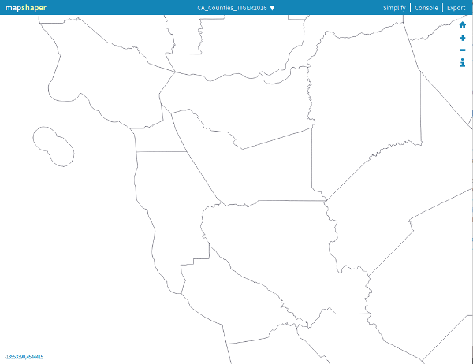
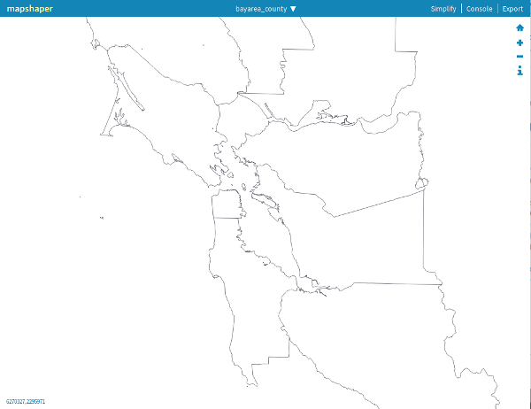

Datawrapper will let you use any shapefile for a basemap, but it has to be in TopoJSON or GeoJSON format, and meet [a few other requirements](https://academy.datawrapper.de/article/145-how-to-upload-your-own-map).

I wanted to create a basemap of Bay Area counties so I could use datawrapper for more local maps. That meant I was going to need to find a basemap, cut out the areas beyond the Bay Area, and convert it to TopoJSON.

I started at the Californa Open Data Portal, where the state makes US Census [county, State and place boundary files ](https://data.ca.gov/dataset/ca-geographic-boundaries) available. Unfortunately, these boundary files aren't clipped to the shoreline. So while they're technically accurate, they're not going to resonate with someone who is used to looking at maps of land.

There are a few ways I could go about clipping the legal boundaries to the shoreline, but the easiest was to search for a map that was already clipped to the shoreline. Luckily, [Cal's library](https://geodata.lib.berkeley.edu/catalog/) maintains their own Geo Data commons and it includes a [boundary file that is clipped to the shoreline](https://geodata.lib.berkeley.edu/catalog/ark28722-s7hs4j).

I wanted a layer that would show us the actual boundaries of Alameda County cities, too. The library's [Places](https://geodata.lib.berkeley.edu/catalog/ark28722-s7bp4z) boundary file includes those.

I pulled these into [Mapshaper's web interface](https://mapshaper.org/) which doesn't do much but does a few things very well.

I followed [Datawrapper's instructions](https://academy.datawrapper.de/article/145-how-to-upload-your-own-map) to transform the maps.

On each layer I had to set the [projection](https://xkcd.com/977/) with `proj wgs84` -- I just typed that command in the console with the layer I was interested in selected.

The other thing I wanted to do was drop the places that are outside of the Bay Area, since the "Places" data is statewide.

With *california_place_clipped* selected, I ran `clip bayarea_county` to drop all the places outside of Bay Area Counties.

I could also use a filter: `filter '"Marin, Contra Costa, Alameda, San Francisco, Santa Clara, San Mateo".indexOf(COUNTY) > -1' `

Then I need to merge the layers into a single shapefile -- for that I did some internet searching. A lot of it, actually, since I don't know mapshaper super well. I think I want [combine-layers](https://github.com/mbloch/mapshaper/wiki/Command-Reference) but I'm not 100% confident using it in the console of the web interface.

`help merge-layers`

I also had to [ask for help](https://gis.stackexchange.com/questions/317831/how-do-i-merge-two-layers-in-mapshapers-web-interface) and [nudge the developers directly](https://github.com/mbloch/mapshaper/issues/334).

I'm not quite there yet.

`merge-layers target=bayarea_county,california_place_clipped force` is what I actually needed. 

Eventually I'll also want to add place names to the background map. 
