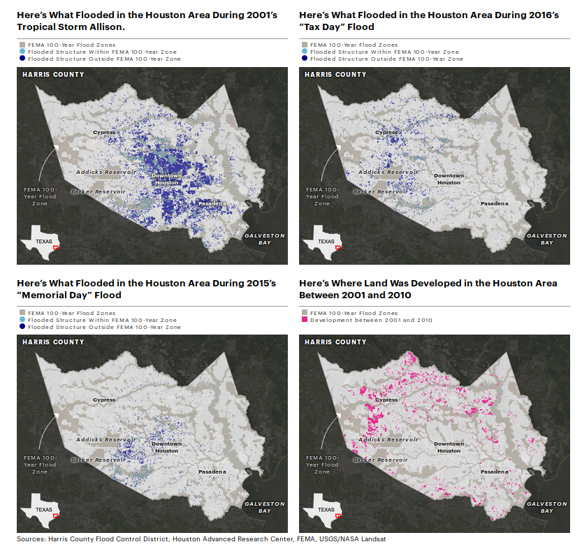

# First a Map

Maps are a powerful reporting tool, and they can be a powerful storytelling tool. We're just going to dabble at the edges today, but there are some great resources under "Keep learning" if you want to do more mapping.

[](https://projects.propublica.org/graphics/harvey-maps)
<sup><sub>ProPublica, Reveal and The Texas Tribune collaborated to map a series of stories about [Hurricane Harvey's impact in Houston](https://projects.propublica.org/graphics/harvey-maps).
Credit: Al Shaw and Lisa Song, *ProPublica*; Kiah Collier, *The Texas Tribune*; Neena Satija, *The Texas Tribune* and *Reveal*, January 3, 2018.</sub></sup>

## Core concepts

### Shapes, points, and lines

#### Points
"Geocoding" refers to the process of identifying an individual latitude/longitude pair for an address or other location description. To actually plot a location on a map, you need the location's latitude and longitude. `906 Washington` means nothing without coordinates.

Geocoding is often challenging because there aren't great free resources for doing batch jobs or processing many addresses at once. The [Geocoding Tip Sheet](https://github.com/amandabee/workshops/wiki/Tip-Sheet:-Geocoding) is a round up of good options, but often public data sources already include coordinates.

#### Lines
A line is a series of two or more points connected together -- you learned that in Geometry. Think bus routes and flight paths.

#### Polygons
Counties, council districts, police precincts -- these are all polygons. But not zipcodes. [Zipcodes aren't shapes](https://github.com/iandees/wtf-zipcodes).


> Y'all. ZIP codes are not defined areas. Addresses have ZIP codes. The definition of a "ZIP code" is a list of addresses. And there are lots of different ways to take a bunch of points and turn them into a polygon. --[Lyzi "Bonecrusher" Diamond](https://twitter.com/lyzidiamond/status/1071627800967139328)

Geographic polygons are usually defined in one of two specialized file formats -- a "Shapefile" or a "KML" file. The syntax of the file types varies, but they contain basically the same information -- a series of lat/lon pairs that connect to form the shape.

If you have high school graduation rates by school district, and you want to map those, you need to find a shapefile that describes the outline of each school district, and then you need to combine that shapefile with your data, by identifying a column that the two tables have in common.

The [Shapefiles Tip Sheet](https://github.com/amandabee/workshops/wiki/Tip-Sheet:-Shapefiles) has some excellent resources for finding shapefiles.

## Datawrapper

This straightforward, if disturbing, BuzzFeed piece on a CDC report on [rising suicide rates nationwide](https://www.buzzfeed.com/carolinekee/suicide-rates-increase-us-2016-all-states) includes a map from the CDC. It isn't a terrible map, but there are a few ways it could be much better.


Can you tell at a glance **which states stand out** as having the most severe increase?

Take a look at the legend. The sizes on those buckets are wild. The darkest has a 20 percentage pt spread, and the next has just a six percentage pt spread. These are quantiles: the CDC designed the buckets so that each would have ~12 states in it. And then they chipped off Nevada which is the only state that saw a decrease.

I should be able to explain why epidemiologists prefer quantiles to equal intervals, but I haven't dug in deep enough to be able to explain it. I did find what appears at a glance to be [a scientific paper](https://bmcmedresmethodol.biomedcentral.com/articles/10.1186/1471-2288-12-21) arguing against the practice.


BuzzFeed News helpfully links to the original report -- the raw data is available [from the CDC](https://www.cdc.gov/vitalsigns/suicide/infographic.html#graphic1) in the [Morbidity and Mortality Weekly Report](https://www.cdc.gov/mmwr/index.html).

» *Question:* is this data organized into points, lines or shapes?

To avoid hiccups in the copy and paste process, I went ahead and pulled the numbers for you. <https://app.workbenchdata.com/workflows/5852>

Workbench bills itself as a "data journalism platform" which seems a bit excessive, but it is a great way to share data, especially if you did some work to transform it from its source.

**Step 0:** Log into Datawrapper and choose "Create a map". We want a choropleth. Fun thing I finally looked up: "choropleth" comes from the Greek words `chóros` (area or region) and `plíthos` (multitude).


**Step 1:** Search for "USA States" under "What type of map do you want to create?".

Question that came up last time I taught mapping with Datawrapper: *Why is the electoral college hex map different from the population hex map?* It turns out there are a few reasons. First, the census updates population estimates more often than the electoral college is redesigned. Second, the actual electors aren't based entirely on population. Each state gets one Elector for each senator (2) and one for each congress person (varies, maps are redrawn every 10 years). DC always gets 3 Electors (or, no more than the least populous state). 🏅 if you already knew that.

**Step 3:** Download your data from Workbench and add it to Datawrapper.

» *Question:* do we have ISO-Codes or Names in our data?

Once you've uploaded your data, read through the next screen, too.As you step through these dialog windows, they should make sense.


You've already got a much cleaner map. And a single state that really stands out.
The Washington Post [wrote more about why suicides](https://www.washingtonpost.com/news/to-your-health/wp/2018/06/07/u-s-suicide-rates-rise-sharply-across-the-country-new-report-shows/) have risen so much. They note how much ND stands out, but they don't have an explanation either.

**Step 4:** Customize your gradient and your tooltips. The average nationwide was a 25.4% increase. You could reasonably center your buckets there. Or you can keep the default gradient. Add tooltips.


`{{ Increase_Decrease }} of {{ Overall_Percent_Change }}%`


Play with the colors. [ProPublica recommends](https://github.com/propublica/guides/blob/master/news-apps.md#colors) [ColorOracle](http://colororacle.org/) to find web safe colors and test for color blindness. ColorOracle takes some setup so for now use [Color Brewer](http://colorbrewer2.org/).

**Step 5:** Add a title and description. Fill in the rest of the metadata.

**Title:** What is the takeaway here? In the BuzzFeed story, they captioned this "Suicide rates increased in almost all states between 1999 and 2016 — some by more than 30%.", but the chart uses "Figure. Percent change in annual suicide rate,* by state-- United States , from 1999/2001 to 2014/2016" -- in reporting and story telling, your chart title should tell readers what they're looking for in the chart.

**Caption:** Tell your readers more about what we're looking at. "A recent CDC report found that there is just one state in the union -- Nevada -- where suicides did  not rise between 1999 and 2016."

**Step 6:** Embed it!

Question: -- *If these rates are both based on the 2000 population, how much does this map just reflect population growth?* It's a good question. According to the Census [Nevada was the US state with the the highest growth](https://www.census.gov/newsroom/blogs/random-samplings/2011/03/population-distribution-and-change-2000-to-2010.html) between 2000 and 2010, but suicides there dropped.

## A few maps
Mago Torres and her colleagues spent over a year compiling data
on mass graves across Mexico while reporting on mass graves in Mexico. Their project [A dónde van los desaparecidos](https://adondevanlosdesaparecidos.org/) is available in English on The Intercept -- [2,000 Clandestine Graves: How a Decade of the Drug War Turned Mexico Into a Burial Ground](https://theintercept.com/2018/12/13/mexico-drug-war-mass-graves/).

ProPublica's [Guide to Every Permitted Natural Gas Well in West Virginia](https://projects.propublica.org/graphics/wva-well-pads) powerfully illustrates the impact of a massive expansion in horizontal well permits.

Capital Public Radio's [history of California wildfires](http://projects.capradio.org/california-fire-history/#6/38.58/-121.49) looks at a question that ought to be on everyone's mind after two years in a row of devastating fall wildfires. They wrote about [how they did it](https://source.opennews.org/articles/how-we-mapped-more-100-years-california-wildfire-h/) on [Source](https://source.opennews.org/). A few more fire maps:
* [KQED Property and Structures Damage](http://ww2.kqed.org/news/2017/10/19/map-cal-fire-maps-homes-damaged-or-destroyed-in-north-bay-fires/) was the most visited during the fires.
* [Fire hazard zones](https://ww2.kqed.org/science/2017/10/31/map-see-if-you-live-in-a-high-risk-fire-zone-and-what-that-means/) are public record -- as the 2017 fires cooled down, KQED pointed out that most of the devastating 2017 Napa and Sonoma fires were in "moderate" fire hazard zones.
* Peter Aldhous mapped [two decades of wildfires](https://www.buzzfeednews.com/article/peteraldhous/wildfire-risk-maps-search-your-home)

[Something in the water](https://signalhfx.ca/deadly-water/), King’s College School of Journalism (2017) started as a mapping exercise and grew from there.

National Geographic's [interactive map of bird migrations](https://www.nationalgeographic.com/magazine/2018/03/bird-migration-interactive-maps/) is stunning. They wrote about [how they built it](https://source.opennews.org/articles/how-we-made-billions-birds-migrate/), too.

FT mapped [broadband speeds in Britain](https://ig.ft.com/gb-broadband-speed-map/) and wrote about [how they built it](https://source.opennews.org/articles/how-we-made-our-broadband-map-using-mapbox/)

## Keep learning

* Source's guide to [Better Mapping](https://source.opennews.org/guides/better-mapping/) is a fantastic round up of articles.

* **[Mapbox](https://www.mapbox.com/)** is powerful, but not nearly as cut and paste as Datawrapper. Lo Benichou has written some fantastic [Mapbox tutorials](https://www.mapbox.com/help/tutorials/).

* **QGIS** plays nicely with **PostGIS** and in combination the two can be a powerful geographic analytical tool. QGIS doesn't output interactive maps but you can run much more complex queries like [measuring distance](https://postgis.net/docs/ST_Distance.html) or identifying all the [points inside](https://postgis.net/docs/ST_Within.html) of a given shape. QGIS will generate SVG files that you can style in a vector graphics editor (eg. Inkscape, Illustrator) for publication. This is what I use.

* These [Dutch election maps](https://multimedia.tijd.be/2018/verkiezingen2018/) were made in **ggplot2** (an **R** package), working from [a comprehensive tutorial tutorial](https://timogrossenbacher.ch/2016/12/beautiful-thematic-maps-with-ggplot2-only/#more-intuitive-legend). You can definitely do powerful geographic analysis inside of R.

* Andrew B Tran publishes his NICAR workshops on Github including his session on [Mapping with R](https://github.com/andrewbtran/NICAR/tree/master/2019)

* You can create interactive maps in **D3**. Mike Bostock has a [solid tutorial](https://medium.com/@mbostock/command-line-cartography-part-1-897aa8f8ca2c) available.


# Break: 2:30 - 2:40 PM


# Then came the command line

Getting under the hood of your computer is kind of a super power.

## Terminal

It's in `Applications / Utilites`, or you can use Spotlight to surface it.

Under `Terminal > Preferences` and set the default to "Homebrew" -- you can fuss with that on your own later if you'd like a different color scheme, but for now we should all feel like `l33t h@x0rz` for a bit.

Add "open in terminal" to your finder  Right click in the finder and look for the `services > New Terminal` check box.

### Bash, term, console: disambiguation

Some vocabulary: `Terminal` is an OSX app that provides you direct access the command line. `Command Line Interface` or `cli` is the interface you see in the terminal. The `shell` is the command line interpreter -- there are a few different shells, but `bash` is the most common. The `console` is a hardware interface -- the physical machine, but people sometimes use the term to apply generically to terminal applications. The `prompt` is the actual line in your shell that is waiting for input. Most of the time by default that is something like `$` -- mine is `amanda@mona:~$ `

Technically this sentence is accurate: Terminal runs a shell, such as bash, that gives you access to a command line interface where you can use the command line to run commands by typing them at the command prompt.

Functionally, the terms are interchangeable and anyone who tells you otherwise is an insufferable pedant and a gatekeeper and you don't need them in your life. [Just kidding](https://askubuntu.com/questions/506510/what-is-the-difference-between-terminal-console-shell-and-command-line).

### Baby steps

Once you have a terminal prompt, let's look around.

⚠️ Starting with a big loud warning. ⚠️

You can make a terrible mess using the terminal. For instance this simple command:  `rm -r /` will ... wipe the contents of your entire computer if you run it as root. You shouldn't run any command at the terminal without knowing what it does.

2. Try running `pwd` -- note that when I say "run `pwd`" what I mean is "type the command `pwd` at the prompt and hit <kbd>enter</kbd>". That command, "print working directory" will tell you what directory you are currently in.
3. Try running `cd`. And then run `pwd` again.
4. Type `cd Dow` and use tab completion to fill in the rest: it should populate with `Downloads`. Run it by hitting <kbd>enter</kbd>.
5. Try running `ls` and `ls -al` -- `-a` and `-l` are "options" that extend the `ls` command.
6. Run `man cat` -- what does the `cat` command do? If you run `cat` by itself it is going to hang, waiting for you to tell it what to concatenate. Use <kbd>ctrl</kbd><kbd>c</kbd> to escape.
7. When you ran `ls` did you see any `csv` files? Try printing one to the screen with `cat {filename}.csv` -- `{filename}.csv` is an argument that extends the `cat` command. Those curly braces are a convention you'll see a fair bit, they indicate that you need to replace the `{generic term}` with a real term. You probably don't have anything called `filename.csv` but you have a few things that have a filename.

We'll stop here -- all we really need is access to the command line in general, and a foolproof way to figure out what directory we're in.

A word of advice: tab completion is your friend. Copy and paste is your sworn enemy.

There are tools you can use at the command line to ☠️ destroy ☠️ your machine, so if someone tells you to "just run this command", always make sure you understand what the command does. `man {command}` is your friend here.

## CSVkit

R is powerful but sometimes you just want to examine a CSV without R. Sometimes you want to subset it or sort it or see the unique values in a particular column. The [CSVkit manual](https://csvkit.readthedocs.io/en/latest/) has an overview of functionality.

### Install Party

You do need to know your way around the command line to  [install csvkit](/workshops.wiki/Tutorial:-Installing-CSVKit.md). Start by trying `which pip` -- if `pip` is installed, you'll see the path to your `pip` instance. If it isn't, you'll just get a new command prompt.

If `pip` is installed, you can do `pip install csvkit` and you'll be good to go. You might need to install as root, which means running `sudo pip install csvkit`

If it isn't, you'll need to [take a step back](https://csvkit.readthedocs.io/en/latest/tricks.html#installation) and install Homebrew first. We'll use [their instructions](https://csvkit.readthedocs.io/en/latest/tricks.html#installation).

#### ⚠️ Never, ever, ever run a command that starts with `sudo` unless you trust the person guiding you or know exactly what the command will do. ⚠️

We're going to use the [CSVkit tutorial](https://csvkit.readthedocs.io/en/latest/tutorial/1_getting_started.html) from their manual because it is well tested and uses genuinely interesting data.

**Step 1:** In the finder, open the folder where you keep your work for this course. Control click and open your terminal. Check your location with `pwd`.

Create a new directory for our walk-through with `mkdir csvkit_walkthrough`

Move into it with `cd csvkit_walkthrough`. Check you're in the right place with `pwd`

**Step 2:** Pull the raw CSV into your folder with `wget http://amandabee.github.io/workshops/2019/j298/ne_1033_data.csv`

**Step 3:** Now we're ready to explore a little bit.

```
csvlook ne_1033_data.csv

csvlook ne_1033_data.csv | less -S

csvcut -n ne_1033_data.csv

csvcut -c 2,5,6 ne_1033_data.csv

csvcut -c county,item_name,quantity ne_1033_data.csv

csvcut -c county,acquisition_cost,ship_date  ne_1033_data.csv | csvstat
```

Keep going with [Examining the data](https://csvkit.readthedocs.io/en/latest/tutorial/2_examining_the_data.html), keeping in mind that tab completion is your friend while copy and paste is your sworn enemy.

### More handy uses for CSVkit

* [csvsql](https://csvkit.readthedocs.io/en/1.0.3/scripts/csvsql.html) will generate a CREATE statement if you need to pull a CSV into a database.

## Keep learning

**Command Line** Noah Veltman has an [excellent resource](https://github.com/veltman/clmystery/blob/master/cheatsheet.md) for learning your way around the command line, or this [2015 NICAR Workshop](https://github.com/chrislkeller/nicar15-command-line-basics) is a great place to start.

**CSVkit**
IRE has a few tipsheets from [2012](https://www.ire.org/resource-center/tipsheets/3683/) and [2016](https://www.ire.org/resource-center/tipsheets/4654/) or there are a few NICAR workshops online, including:

* Dan Nguyen's tutorial on [using `t` and `csvkit` to quickly collect and analyze #nicar16 tweets from the command-line](https://gist.github.com/dannguyen/7c592c4559ee64f753e5)
* Christian McDonald's [2018 NICAR workshop](https://github.com/utdata/csvkit-nicar2018/)
* I have [two more tutorials](https://github.com/amandabee/workshops/wiki/Tutorial:-Using-CSVkit) that are worth walking through if you really want to get the hang of CSVkit.
